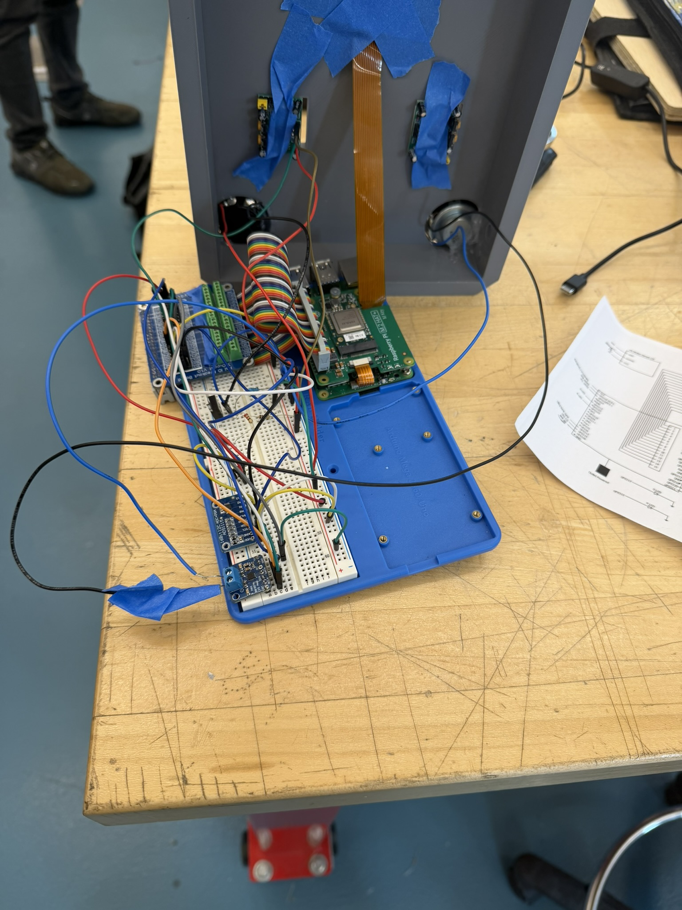

# Wildlife Detector — Raspberry Pi 5 + Hailo-8L

Real-time wildlife detection and deterrent system using a Raspberry Pi 5, Hailo-8L neural accelerator, and a PIR-gated inference pipeline. Detects 9 animal classes and responds with class-specific audio and ultrasonic deterrents.

---

## Demo

### Hardware

| | |
|---|---|
|  |  |
| Full system: Pi 5, Hailo-8L M.2 HAT, breadboard peripherals, 3D-printed enclosure with CSI camera | Wiring detail: rainbow GPIO ribbon, ADS1115, CSI flat cable, PIR and LED connections |

### Live Detections (MJPEG preview via browser)

| Bear — 0.88 | Raccoon — 0.78 | Deer — 0.83 |
|---|---|---|
|  |  |  |

All screenshots captured from the live MJPEG stream on a phone browser. PIR gate was active in all shots (~28 FPS sustained inference).

> **Asset paths:** place the images above in an `assets/` folder at the repo root and rename them to match the paths in this table, or update the paths to match your filenames.

---

## Hardware

| Component | Part / Connection |
|---|---|
| SBC | Raspberry Pi 5 |
| AI Accelerator | Hailo-8L (M.2 HAT) |
| Camera | IMX708 / Camera Module 3 (CSI) |
| Audio Amp | MAX98357A — DIN: GPIO21, BCLK: GPIO18, LRC: GPIO19 |
| Ultrasonic Deterrent | Piezo via MOSFET gate — GPIO13 (PWM1) |
| PIR Sensor | GPIO23 (input, active HIGH) |
| Status LEDs | Green: GPIO17 (active window), Red: GPIO22 (waiting) |
| Temperature | TMP36 → ADS1115 A0 → I2C-1 (SDA: GPIO2, SCL: GPIO3) |
| Amp Enable | MAX98357A SD/EN → GPIO26 |

---

## Detected Animal Classes

`bear` · `coyote` · `deer` · `fox` · `possum` · `raccoon` · `skunk` · `squirrel` · `turkey`

---

## Build

```bash
cmake -B build -S .
cmake --build build --target hailo_detector -j4
```

**Dependencies:** HailoRT, OpenCV, libgpiod v2

---

## Run

```bash
./build/hailo_detector
```

The binary runs with all features enabled by default — no extra flags needed for normal use. Open the live preview at:

```
http://127.0.0.1:8090
```

Replace `127.0.0.1` with the Pi's IP address to view from another device on the network.

---

## How It Works

```
Camera (CSI)
    │
    ▼
PIR Gate FSM ──── [WAITING] ──► no inference, red LED on
    │
    │  PIR triggers
    ▼
[MOTION_CHECK] ──► 1s sampling window to confirm real motion
    │
    ▼
[INFERENCE_WINDOW] ──► 7s window, Hailo inference active, green LED on
    │
    │  detection confirmed
    ▼
[CONFIRMED_HOLD] ──► extends active window while animal is present
    │
    ▼
YOLOv5s (9-class, HEF)
    ├─► Audio deterrent (class-specific .wav via MAX98357A)
    ├─► Ultrasonic burst (class-specific frequency via PWM)
    ├─► Bounding box overlay + FPS / temperature HUD
    ├─► MJPEG preview stream (port 8090)
    └─► Detection frame saved to disk (1 fps max)
```

The PIR FSM prevents the Hailo accelerator from running continuously — inference only starts after confirmed motion and stops automatically once the animal has been gone for 3 seconds.

---

## Deterrent Frequencies

| Animals | Frequency |
|---|---|
| Bear, Coyote, Deer | 17 kHz |
| Fox, Possum, Raccoon, Skunk | 20 kHz |
| Squirrel | 23 kHz |
| Turkey | 30 kHz |

Ultrasonic bursts are generated via hardware PWM (GPIO13 / PWM1). If the PWM overlay is not active, the ultrasonic output is skipped gracefully and the audio deterrent still works.

---

## Configuration

Most settings are at the top of `hailo_detector.cpp` under the **EASY-TO-EDIT SETTINGS** section. Common ones:

| Setting | Default | Description |
|---|---|---|
| `HEF_PATH` | `/home/ecet400/animal_yolov5s_9class/...hef` | Path to the YOLOv5s HEF model |
| `SOUNDS_DIR` | `/home/ecet400/hailo_detector/sounds_i2s` | Directory of per-class `.wav` files |
| `DEFAULT_CONF_THRESH` | `0.40` | Detection confidence threshold |
| `DEFAULT_PREVIEW_PORT` | `8090` | HTTP preview server port |
| `DEFAULT_CAMERA_FPS` | `60` | Camera capture framerate |
| `ADS1115_I2C_ADDR` | `0x48` | I2C address of ADS1115 |

Environment variable overrides (no recompile needed):

```bash
WILDLIFE_GPIO_CHIP=/dev/gpiochip4   # if the 40-pin header is on a different chip
WILDLIFE_PWM_CHIP=/sys/class/pwm/pwmchip2
WILDLIFE_PWM_CHANNEL=0
```

---

## CLI Flags

The binary accepts optional flags for non-default scenarios:

```
--conf <float>          Confidence threshold (default: 0.40)
--fps <int>             Camera FPS (default: 60)
--port <int>            Preview server port (default: 8090)
--host <addr>           Preview server bind address (default: 0.0.0.0)
--no-serve              Disable the HTTP preview server
--no-raw-preview        Disable raw aspect-ratio preview mode
--no-save               Disable detection frame saving
--detection-dir <path>  Directory to save detection frames
--af-mode <mode>        Autofocus mode: continuous | manual (default: continuous)
--lens-position <float> Manual focus lens position (0.0–10.0)
--image <path>          Run inference on a single image and exit
--output <path>         Save annotated image to this path (used with --image)
```

---

## Audio File Layout

Place one `.wav` file per class in `SOUNDS_DIR`. Files are matched by class name (case-insensitive):

```
sounds_i2s/
├── bear.wav
├── coyote.wav
├── deer.wav
├── fox.wav
├── possum.wav
├── raccoon.wav
├── skunk.wav
├── squirrel.wav
└── turkey.wav
```

Playback is handled by `aplay` (`/usr/bin/aplay`). Each class has a cooldown of 6 seconds between plays.

---

## Detection Frame Saving

When a detection occurs, the annotated frame is saved to `DETECTION_FRAME_DIR` (default: `/home/ecet400/hailo_detector/detections`) at up to 1 frame per second. Filenames include a timestamp and the detected class names.

---

## Temperature Display

The TMP36 is read through the ADS1115 ADC over I2C. Temperature is displayed in Fahrenheit on the live preview overlay and updated every 500 ms. An exponential moving average filter (α = 0.70) smooths the readings.

---

## File Structure

```
.
├── hailo_detector.cpp   # Main detector — inference loop, preview server, audio, temp sensor
├── gpio_trigger.hpp     # PIR polling, LED control, ultrasonic PWM bursts (libgpiod v2)
└── CMakeLists.txt       # Build configuration (not included here)
```

---

## Notes

- The binary must be run as a user with access to `/dev/gpiochip0`, `/dev/i2c-1`, and the Hailo device node. Running as `root` or adding the user to the `gpio`/`i2c` groups is typically sufficient.
- If the PWM overlay is not loaded (`dtoverlay=pwm-2chan` or similar in `/boot/firmware/config.txt`), the ultrasonic deterrent is automatically disabled; everything else continues normally.
- The preview server tries up to 10 sequential ports starting from the configured port if the default is already in use.
