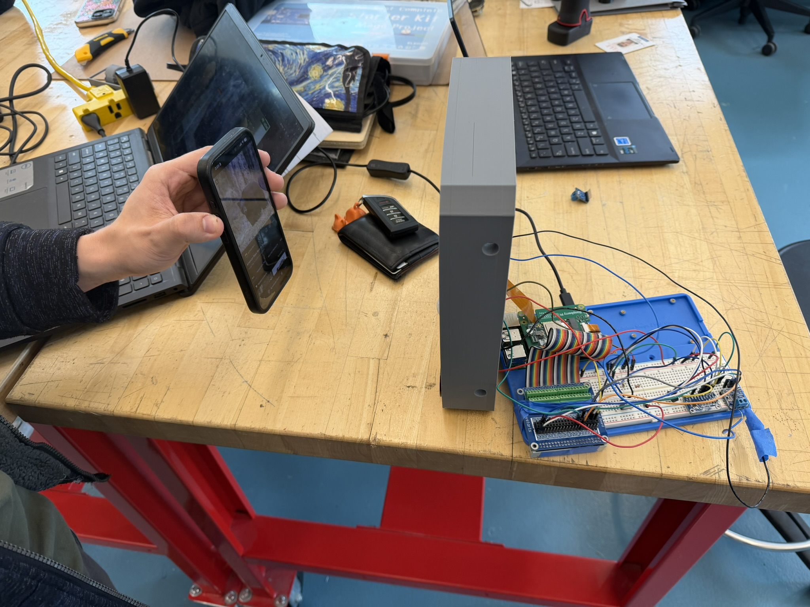
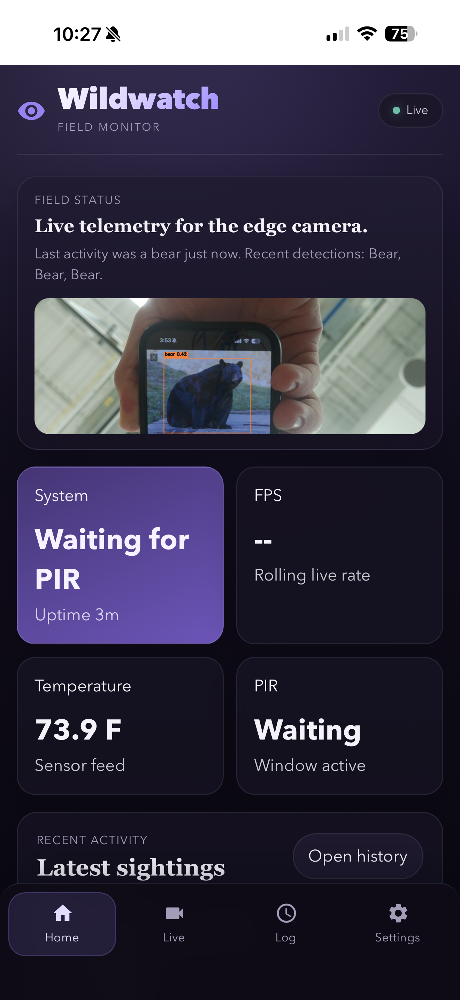
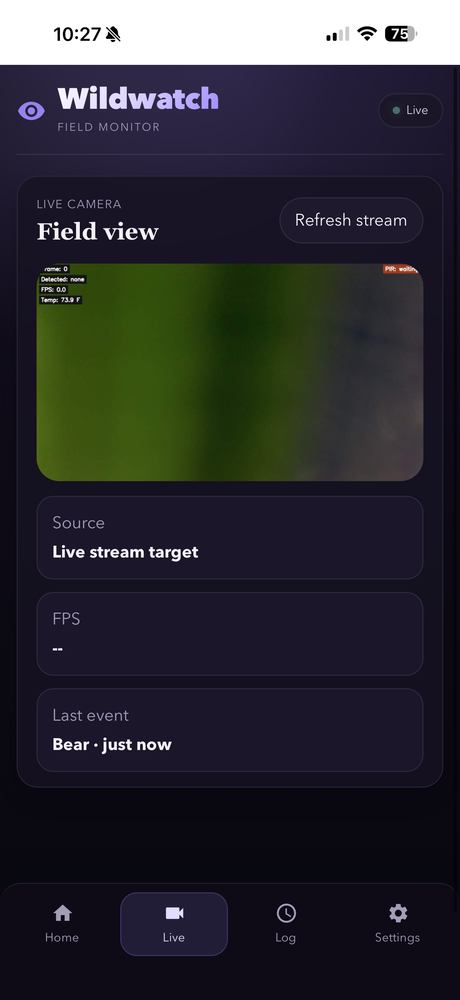
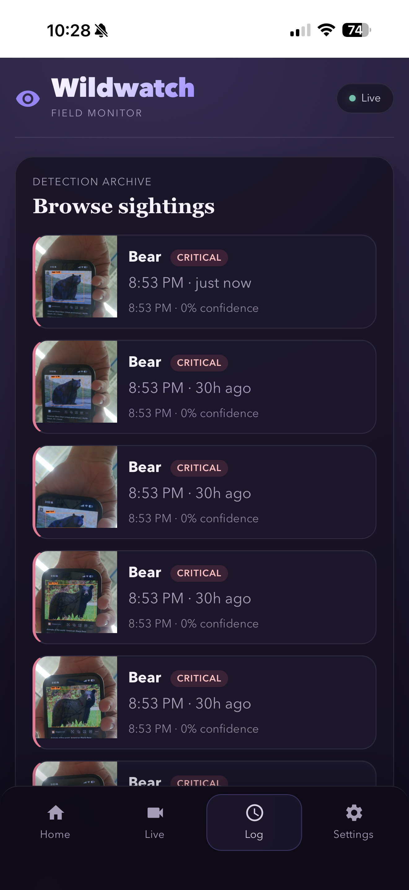
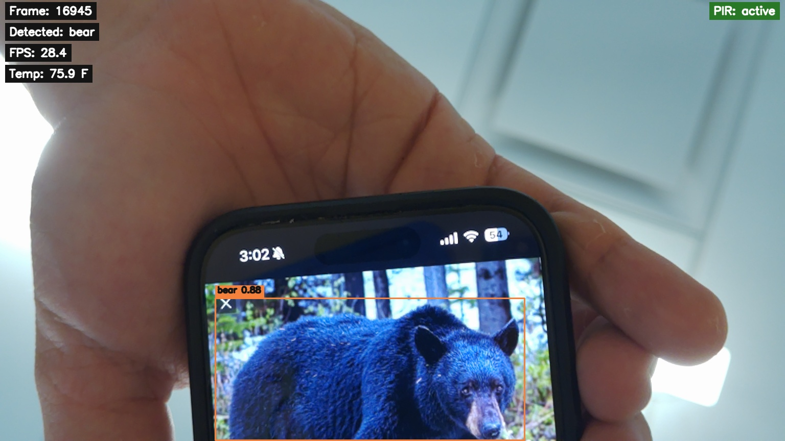
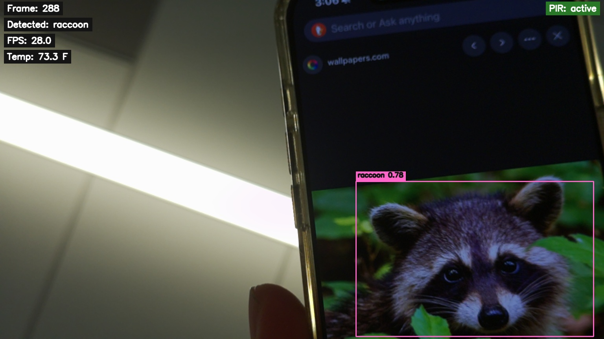
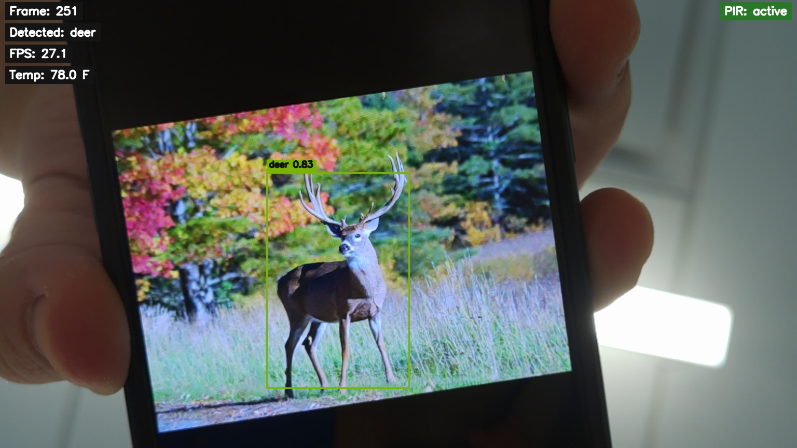

# Wildlife Detector for Raspberry Pi 5 + Hailo-8L

Real-time wildlife detection and deterrent system built around a Raspberry Pi 5, Hailo-8L, CSI camera, PIR-triggered inference flow, and a companion web app stack.

## What this project does

This project is a wildlife monitoring and deterrence system for outdoor use.

It watches the camera feed on a Raspberry Pi 5, runs animal detection on a Hailo-8L, and reacts when wildlife appears. The detector can:

- recognize 9 animal classes
- gate inference using a PIR sensor so the accelerator is not running full-time
- play class-specific audio deterrents
- drive an ultrasonic deterrent output
- serve a live MJPEG browser view
- export structured sighting events for a backend and mobile-style frontend

The repo also includes a companion app stack:

- a FastAPI backend that exposes status, detections, and live SSE events
- a mobile-first PWA frontend for live view and recent detections
- a Kanna companion UI layer that reacts to detection events

## Demo

Video:

- [Wildlife detector demo video](docs/demo/wildlife-demo.mp4)

Hardware:

| Setup | Wiring |
|---|---|
|  |  |

App screens:

| Live app screen 1 | Live app screen 2 | Live app screen 3 |
|---|---|---|
|  |  |  |

Sample detections:

| Bear | Raccoon | Deer |
|---|---|---|
|  |  |  |

## Why it exists

The project is meant to bridge three needs at once:

1. detect real wildlife activity on-device with low latency
2. trigger practical deterrence outputs in the field
3. make the system understandable from a browser or phone instead of only from terminal logs

So this repository is not just an object detector. It is a detector, event pipeline, backend, and interface layer bundled into one system.

## Repo layout

```text
api_server/   FastAPI backend
detector/     C++ detector core and Pi deployment files
docs/         Roadmap and hardware documentation
frontend/     Mobile-first PWA
samples/      Demo media used by the app and docs
```

## System architecture

```text
hailo_detector (C++)
  -> camera capture
  -> Hailo inference
  -> PIR/audio/ultrasonic control
  -> MJPEG preview on :8090
  -> JSONL event log
  -> Unix domain socket live events

api_server (FastAPI)
  -> loads recent events
  -> serves status + detections API
  -> streams SSE events
  -> serves frontend shell

frontend (Vite PWA)
  -> dashboard
  -> live view
  -> detections history
  -> companion animation layer
```

## Main behavior

At runtime, the detector follows this flow:

1. the PIR sensor sees motion
2. the Pi opens an active inference window
3. the Hailo model detects animal classes from the CSI camera feed
4. the detector draws overlays and serves the live MJPEG stream
5. audio and ultrasonic deterrents can fire depending on the detected class
6. the detector emits `sighting_start`, `sighting_update`, and `sighting_end`
7. events are written to JSONL and also pushed live over a Unix domain socket
8. the backend consumes those events and exposes them to the frontend

## What each folder contains

- `detector/`
  Detector-side C++ code, event pipeline, systemd service file, and a small event simulation helper.
- `api_server/`
  Backend API for status, detections, SSE events, and frontend hosting.
- `frontend/`
  PWA shell with live stream UI, detections feed, Ask AI shell, and Kanna companion animation.
- `docs/`
  Project roadmap plus hardware photos.
- `samples/media/`
  Demo images used by the backend and frontend mock mode.

## Core features

- 9-class wildlife detection: `bear`, `coyote`, `deer`, `fox`, `possum`, `raccoon`, `skunk`, `squirrel`, `turkey`
- PIR-gated inference to avoid constant accelerator usage
- MJPEG browser preview
- Detection lifecycle events: `sighting_start`, `sighting_update`, `sighting_end`
- JSONL persistence plus Unix socket live transport
- FastAPI API layer with SSE
- Mobile-friendly frontend with Kanna companion overlay

## Detector-side capabilities

- CSI camera capture on Raspberry Pi 5
- Hailo-8L accelerated inference
- overlay rendering with boxes and runtime telemetry
- browser preview stream on port `8090`
- per-class audio deterrent playback
- ultrasonic deterrent control
- PIR-triggered active window logic
- event export for downstream services

## Backend capabilities

- `GET /api/status`
- `GET /api/detections`
- `GET /api/events`
- `POST /api/dev/emit`
- `POST /api/ask`
- live SSE stream for frontend updates
- static serving for the frontend shell and sample media

## Frontend capabilities

- dashboard summary
- live stream card
- detection history feed
- mock mode for UI development before full backend hookup
- Kanna companion animation and reaction states
- installable PWA shell

## Hardware stack

- Raspberry Pi 5
- Hailo-8L
- CSI camera
- PIR sensor
- MAX98357A audio output
- ultrasonic deterrent output
- status LEDs
- TMP36 + ADS1115 temperature path

## Run the detector

From the detector directory:

```bash
cmake -B build -S detector
cmake --build build --target hailo_detector -j4
./build/hailo_detector
```

Live preview:

```text
http://127.0.0.1:8090
```

## Run the backend

```bash
uvicorn api_server.app:app --host 0.0.0.0 --port 8091
```

## Run the frontend

```bash
cd frontend
npm install
npm run dev -- --host 0.0.0.0 --port 5173
```

## Status

The repository already contains:

- the detector core
- the event lifecycle pipeline
- a backend shell with live event streaming
- a frontend MVP with Kanna integration
- demo assets and documentation media

## Notes

- Production-facing companion assets live under `frontend/assets/kanna/`.
- Large raw art working folders are intentionally excluded to keep the repo easy to browse.
- The longer implementation plan lives in `docs/FRONTEND_BACKEND_ROADMAP.md`.
